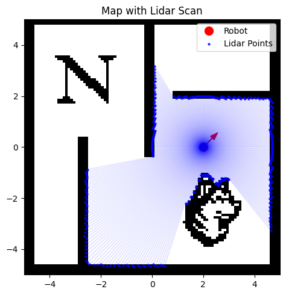
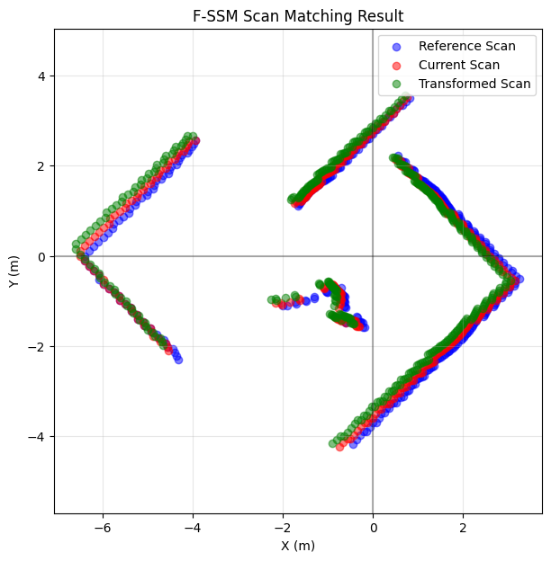
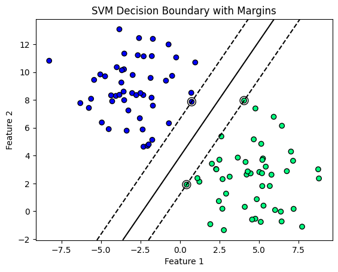
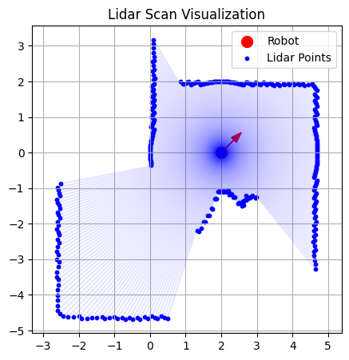

# Coarse-to-Fine Localization: Fast Spectral Scan Matching (F-SSM) & SVM

**EECE 5550 Mobile Robotics — Final Project | Northeastern University**

Implementation of the coarse-to-fine global localization system from [Park & Roh (2016)](https://doi.org/10.1109/TRO.2016.2544301), combining **Fast Spectral Scan Matching (F-SSM)** with an **SVM-based place recognition** pipeline, tested in the NEU Racing gym environment.

---

## 📄 Paper Reference

> Park, S., & Roh, K. S. (2016). *Coarse-to-Fine Localization for a Mobile Robot Based on Place Learning With a 2-D Range Scan*. **IEEE Transactions on Robotics**, 32(3), 528–544.

---

## 🗺️ System Overview

The localization pipeline operates in two stages:

| Stage | Method | Purpose |
|---|---|---|
| **Coarse** | SVM (One-Against-All) | Identify candidate local places from a single range scan |
| **Fine** | F-SSM + RANSAC + Particle Filter | Estimate precise robot pose within candidate places |


*Lidar scan data visualized in the NEU Racing Environment*

---

## 🔧 Algorithms Implemented

### 1. Fast Spectral Scan Matching (F-SSM)

F-SSM estimates the relative pose between two range scans **without requiring an initial alignment or geometric features**. It improves upon SSM by:

- Approximating the affinity matrix M̂ via a linear combination of Kronecker products of **base matrices (Bᵢ)** and **index matrices (Hᵢ)**, exploiting redundancy in pairwise distances:

$$\hat{M} = \sum_{i=0}^{K-1} H_i \otimes B_i$$

- Using a **Bases Power Method with Bistochastic Normalization (BN)** to enforce a one-to-one mapping constraint on correspondences
- Applying the **Hungarian algorithm** to binarize the continuous assignment matrix
- Using **RANSAC-based pose estimation** to recover (x, y, θ) from matched correspondences

**Key advantages over SSM:** ~106× less memory, ~156× faster computation.


*F-SSM scan matching result — blue: reference scan, red: current scan, green: transformed scan*

---

### 2. SVM-Based Place Recognition

A basic SVM classifier was implemented to understand the coarse localization stage:

- Two-class separation using a linear hyperplane (decision boundary)
- Trained with `sklearn`'s SVM implementation
- Kernel options explored: linear, polynomial, RBF, sigmoid
- Support vectors and margin boundaries visualized


*SVM decision boundary with margins separating two feature classes*

---

## 🤖 Environment

The project uses the **NEU Racing Gym Environment** built on [Gymnasium](https://gymnasium.farama.org/).

### Components

- **Motion Model:** Unicycle model — state vector `[x, y, θ]`
- **Sensor Model:** 2D Lidar simulation + State Feedback
- **Observation Wrappers:**
  - `StateFeedbackWrapper` — returns robot state only
  - `MappingWrapper` — returns state + lidar
  - `LocalizationWrapper` — returns lidar only

```python
# Example: Setting up the localization environment
import gym_neu_racing
from gym_neu_racing.wrappers import LocalizationWrapper
import gymnasium as gym

env = gym.make("gym_neu_racing/NEUMapping-v0")
env = LocalizationWrapper(env)
obs, info = env.reset()
```

### Registered Environments

| ID | Map | Use Case |
|---|---|---|
| `gym_neu_racing/NEURacing-v0` | Circle | Racing / navigation |
| `gym_neu_racing/NEUMapping-v0` | Square NEU | Mapping / localization |
| `gym_neu_racing/NEUEmptyWorld-v0` | Empty | Goal-reaching tasks |

---

## 📊 Results

### F-SSM Scan Matching

The algorithm successfully computes rotation matrix **R** and translation vector **t** to align scans from different robot poses. Green transformed points closely match the current (red) scan, though small deviations indicate room for parameter tuning (bin width `w` and sensitivity `σd`).

### Localization Performance

Integration of F-SSM with the unicycle motion model shows discrepancy between true and estimated paths, highlighting the challenge of accumulating pose errors in continuous localization without a full particle filter implementation.


*Localization attempt — blue: true path, red dashed: F-SSM estimated path*

### Lidar Visualization


*Lidar scan data plotted in MATLAB showing sensor field of view*

---

## 📁 Repository Structure

```
├── gym_neu_racing/
│   ├── envs/
│   │   ├── __init__.py
│   │   ├── racing.py           # NEURacingEnv
│   │   ├── empty_world.py      # NEUEmptyWorldEnv
│   │   └── map.py              # 2D occupancy grid map
│   ├── wrappers/
│   │   ├── __init__.py
│   │   ├── state_feedback_wrapper.py
│   │   ├── mapping_wrapper.py
│   │   └── localization_wrapper.py
│   └── __init__.py             # Gymnasium environment registration
├── Final_Project_MR.ipynb      # Main implementation notebook
├── images/                     # Result figures
└── README.md
```

---

## ⚙️ Installation

```bash
git clone https://github.com/vadivel-ahi/FSSM-ScanMatching.git
cd FSSM-ScanMatching

pip install numpy gymnasium matplotlib scipy scikit-learn Pillow
pip install -e .
```

---

## 🚀 Usage

Open and run [`Final_Project_MR.ipynb`](Final_Project_MR.ipynb) to:

1. Set up the NEU Racing environment with lidar sensor
2. Run the F-SSM correspondence detection and pose estimation
3. Visualize scan matching results
4. Run the basic SVM classifier demonstration

---

## 📌 Key Parameters

| Parameter | Symbol | Description |
|---|---|---|
| Bin width | `w` | Controls approximation granularity of affinity matrix |
| Matching sensitivity | `σd` | Controls deformation tolerance in correspondence scoring |
| RANSAC iterations | `N` | Number of pose hypothesis trials |
| Noise scale | `ρ` | Initial sample spread for particle filter |

---

## 📚 References

1. Park, S., & Roh, K. S. (2016). Coarse-to-fine localization for a mobile robot based on place learning with a 2-D range scan. *IEEE Transactions on Robotics*, 32(3), 528–544.
2. NEU Racing Gym Environment — EECE 5550 Mobile Robotics, Northeastern University

---

## 👤 Author

**Ahilesh Vadivel** | NUID: 002055401  
EECE 5550 Mobile Robotics — Northeastern University
